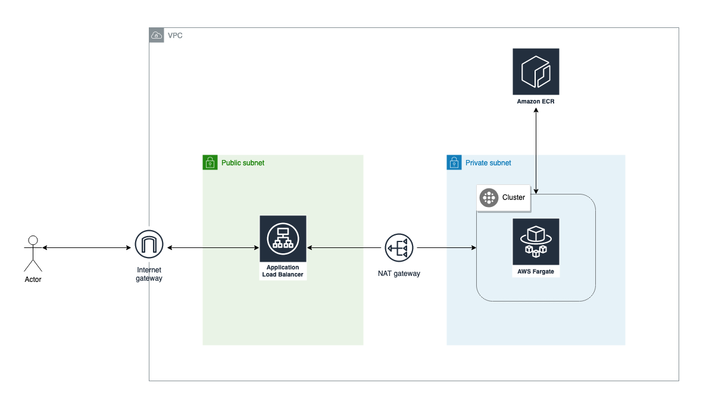

# Troposphere Playground
Experimenting with Troposphere...



## First-time Setup

* Run `make deps-install`
* Run `make run` and you'll get the Cloudformation YAML in the `dist` folder
* Upload the Cloudformation templates to your AWS Account using your preferable method (e.g. aws cli or Console)

## Stack Templates
* **tropo-ecr.yaml**: Start off by deploying the ECR stack. That way you will be able to compose and push the dockerized `httpd` server and have your image set for your fargate conatainers. The ECR repository is caller `tropo-repository`. Follow the guide on the Console to push your image to the repository. The `Dockerfile` is in the root of this package.
 **WARNING**: If you are building the image in a platform other than Linux execute: `docker buildx build --platform=linux/amd64  -t tropo-repository .` instead.
* **tropo-vpc.yaml**: Next go for the network resources that are the prerequisite for deploying your main application
* **tropo-app.yaml**: Finally, deploy your main application stack. When it is done, go to the `Outputs` tab of the Cloudformation window. There you will find the ALB endpoint to test that your application is up and running.

## Build Details
```bash
$ make
Some available commands:
 * run          - Run code.
 * deps-install - Install dependencies (see requirements.txt).
 * deps-update  - Update dependencies (via pur).
```
